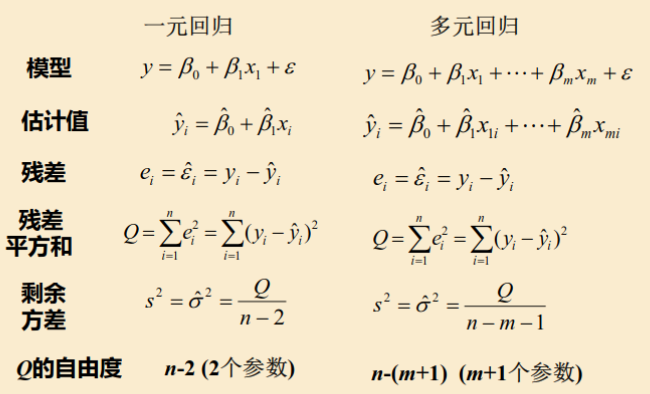
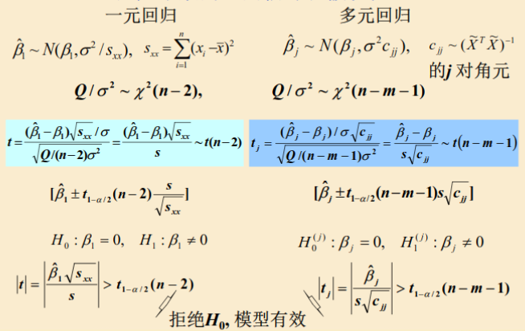
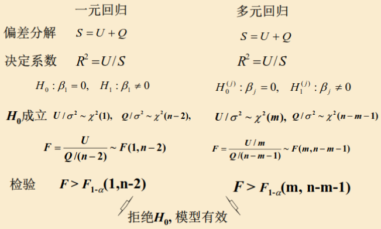
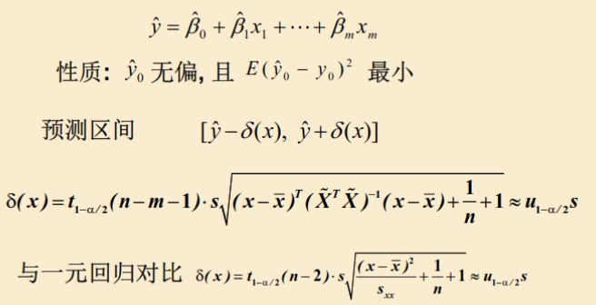

# 数学实验

## 数值积分

### 插值型积分（数学知识）

#### $n$次插值多项式

最高幂$n$，$n+1$个参数，需要取$n+1$个点$x_0, ..., x_n$来插值

对函数$f$以及取点$\{(x_i,y_i)\}_0^n$，可以用$n+1$个多项式$l_k$来描述$f$：
$$
L_n(x)=\sum_{k=0}^n {f(x_k)}l_k(x)=\sum y_kl_k(x)\\
f(x)=L_n(x)+余项R_n(x) 
$$
数值积分$I_n$就是每个多项式的积分之加**权**($y_k$) 和：
$$
A_k=\int_Sl_k(x)\mathrm{d}x,\\
I_n=\sum_kA_ky_k=A_kf(x_k),\\
I_f=I_n+\int_{S}R_n(x)\mathrm{d}x\equiv I_n+E_n
$$

#### 代数精度

设幂函数$f(x)=x^{k}$，如果存在一个**最小的**$k=m+1$使得$I_n\neq I$，那么$m$就是$I_n$的代数精度

$n+1$个节点的插值求积公式**至少**有$n$次代数精度。

$n$阶插值求积式有$2n+1$次代数精度$\iff$求积节点是$[a,b]$上的$n+1$次正交多项式的零点

#### Legendre多项式

$$
l_n(x)=\frac{1}{2^nn!}\frac{\mathrm{d}^n}{\mathrm{d}x^n}\left[(x^2-1)^n\right], n\geq1; \\
l_0(x)=1, l_1(x)=x
$$

#### Gauss公式

先将区间变换到[-1,1]，然后按上面计算。

#### 复合Gauss公式（Gauss-Lobatto）

由于-1和1是$n\geq2$的Legendre多项式的零点，所以如果把区间分成若干份，端点都是要取到的。一般阶数较小。

#### 收敛性(\*)

对积分$I$的某个数值积分$I_n$，
$$
\lim_{n\to\infty}\frac{I-I_n}{h^p}=c\neq0,
$$
那么$I_n$是$p$阶收敛的。

### 插值求积公式汇总

实际应用当中我们一般用它们的复合形式或者自适应形式。

| 名字   | 形式                                                         | 误差上界                                 | 复合收敛阶 |
| ------ | ------------------------------------------------------------ | ---------------------------------------- | ---------- |
| 梯形   | $\frac{b-a}{2}(f(a)+f(b))$                                   | $\frac{(b-a)^3}{12}\|f''\|_{\max}$       | 2          |
| 辛普森 | $\frac{b-a}{6}\left(f(a)+4f\left(\frac{a+b}{2}\right)+f(b)\right)$ | $\frac{(b-a)^5}{2880}\|f^{(4)}\|_{\max}$ | 4          |
| 高斯   | $A_1f(a)+\sum_{k=2}^{n-1}A_kf(x_k)+A_nf(b)$                  | $?$                                      | $2n-2$     |

## ODE

### ODE初值问题（数学知识）

常微分方程的一般形式：
$$
\begin{cases}
y'=f(x,y),\\
y(x_0)=a,
\end{cases}
$$
问在$\{x_i\}_0^n$处，$y$的近似取值$y_k\approx y(x_k)$。一般$x_i=x_0+ih$，步长为$h$。已知$y_0 =a$。

#### 单步法

常见的是Euler法。*t0*
$$
y_{n+1}=y_n+h\varphi(x_n,y_n,y_{n+1};h),
$$
其中$\varphi$称为增量函数；如果其跟$y_{n+1}$有关，则为隐式法；否则为显式法，可以直接计算。

#### 误差

局部截断误差：假设$y_n=y(x_n)$，讨论$y_{n+1}$的误差。

使用Taylor展开来进行分析：
$$
y(x_{n+1})=y(x_n)+hy'(x_n)+\frac{h^2}{2}y''(x_n)+O(h^3),
$$
利用局部截断假设，计算真实值（通常要Taylor展开）与估计值的差。**$h$的阶数最小的项叫做局部截断误差主项**。

#### 精度

如果局部截断误差的主项是$h^{p+1}$级的，那么称单步法具有$p$阶精度，是$p$阶方法。

#### Runge-Kutta

在每一步之内不止使用2个点。用待定参数法，将这些点处的导数($f$)值求加权平均，构造出精度更高的计算式。

由于出现了$f$在中间点的取值，所以需要用二维泰勒展开来估计$f$：
$$
\begin{split}
f(x+A,y+B)=f(x,y)+Df(x,y)+\frac{1}{2}D^2f(x,y)\\+...+\frac{1}{n!}D^nf(x,y)+O\left((A+B)^{n+1}\right),
\end{split}\\
D=A\frac{\partial}{\partial x}+B\frac{\partial}{\partial y}
$$
一般形式如下：
$$
\begin{cases}
y_{n+1}=y_n+h\sum_i\lambda_iK_i,\\
K_1=f(x_n,y_n),\\
K_i=f(x_n+c_ih, y_n+c_ih\sum_{j=1}^{i-1}a_{ij}K_j),
\end{cases}
$$
要求$\sum\lambda_i=1$, $\sum_{j=1}^{i-1}a_{ij}=1$，一共是$K_1$到$K_L$，叫做$L$阶R-K方法。

经典的龙格库塔方法是4级、4阶的。

### 方法汇总

| 名字      | 形式                                                         | 精度 |
| --------- | ------------------------------------------------------------ | ---- |
| 向前Euler | $y_{n+1}=y_n+hf(x_n,y_n)$                                    | 1    |
| 向后Euler | $y_{n+1}=y_n+hf(x_{n+1},y_{n+1})$                            | 1    |
| 梯形Euler | $y_{n+1}=y_n+\frac{h}{2}(f(x_n,y_n)+f(x_{n+1},\bar{y}_{n+1}))$ | 2    |
| 改进Euler | $\bar{y}_{n+1}=y_n+hf(x_n,y_n)$, $y_{n+1}=y_n+\frac{h}{2}(f(x_n,y_n)+f(x_{n+1},\bar{y}_{n+1}))$ | 2    |
| 龙格库塔  | 见上                                                         | L    |

 步长的选择请看下面[稳定性](# 稳定性)。

## 线性方程组问题

### 数学知识

####  高斯消元和矩阵初等变换

高斯消元法等价于矩阵的LU分解。对于A，存在A=LU，L是一个下三角阵，U是一个上三角阵。有
$$
Ax=LUx=b
$$
因此事实上我们是先解
$$
Ly=b
$$
再解
$$
Ux=y
$$
对于对称正定矩阵，$A=LL^\intercal$。

#### 矩阵范数

常见的矩阵范数（以及矩阵范数的定义）：

| 阶                       | 值                                     |
| ------------------------ | -------------------------------------- |
| 1-范数                   | $\max_j\sum_i|a_{ij}|$                 |
| 2-范数                   | $\sqrt{\lambda_{\max}(A^\intercal A)}$ |
| **p-范数**（范数的定义） | $\max_{\|x\|_p=1}\|Ax\|_p$             |
| $\infty$                 | $\max_i\sum_j|a_{ij}|$                 |

由定义直接得到不等式：$\|Ax\|\leq\|A\|\|x\|$

#### 条件数和扰动误差

$$
Cond(A)=\left\|A^{-1}\right\|\|A\|
$$

误差：考虑$b$的扰动$\delta b$，$x$有误差$\delta x$，则
$$
A(x+\delta x)=b+\delta b,\\
A\delta x=\delta b.
$$
可以得到不等式
$$
\frac{1}{cond(A)}\frac{\|\delta b\|}{\|b\|}\leq \frac{\|\delta x\|}{\|x\|}\leq cond(A)\frac{\|\delta b\|}{\|b\|}
$$
其中前半段说明了$x$误差的下限，后半段说明了$x$误差的上限。条件数越大，$x$的误差可能会越大。

病态矩阵：条件数大（多大？）的矩阵

#### 迭代法解稀疏矩阵

关键：构造矩阵B和向量f满足：对于解$x$，有
$$
x=Bx+f
$$
下面设$A=D-L-U$是$A$的自然分解，$D$, $L$, $U$分别是对角，下三角，上三角矩阵。

另一种描述：
$$
x=x+C(b-Ax)
$$

当$C$接近$A^{-1}$时，收敛就快。

##### Jacobi和Gauss-Seidel

见表格。注意可以写成

- Jacobi：$Dx(k+1) = Lx(k)+Ux(k)+b$ 
- Gauss-Seidel：$Dx(k+1)=Lx(k+1)+Ux(k)+b$  

或是把D除过去。

##### 迭代的收敛条件

$\rho(B)=\max|\lambda(B)|<1$，也即谱半径小于1。注意**取模**。

充分条件：

- 对角线占优：同行对角线元素最大（取模），则收敛
- 对称正定：Gauss-Seidel收敛
- B的任何一种范数小于1：收敛（注意谱半径自身小于等于所有的范数）

#### 超松弛SOR迭代

用G-S
$$
x(k+1)=\textcolor{blue}{D^{-1}(Lx(k+1)+Ux(k)+b)}
$$
推广：
$$
x(k+1)=\omega\textcolor{blue}{D^{-1}(Lx(k+1)+Ux(k)+b)}+(1-\omega)x(k)
$$
当$\omega=1$，是G-S；大于1为超松弛，小于1为低松弛。如果$A$对称正定，那么收敛$\iff$$\omega\in(0,2)$。

### 方法汇总

| 名字   | 方法                                                         |
| ------ | ------------------------------------------------------------ |
| Jacobi | $B=D^{-1}(L+U),\\ f=D^{-1}b$                                 |
| GS     | $B=(D-L)^{-1}U,\\ f=(D-L)^{-1}b$                             |
| SOR    | $B=(D-\omega L)^{-1}(\omega U+(1-\omega)D),\\ f=(D-\omega L)^{-1}\omega b$ |

## 非线性方程

### 数学知识

#### 重根

$m$重根=前$m-1$阶导数都为0，到m阶不为0

#### 非线性方程

$$
f(x)=0
$$

二分法：需要单调性；收敛慢

#### 迭代方法

选择迭代函数
$$
\varphi(x)
$$
以满足在非线性方程的根处有$\varphi(x)=x$，也即原方程的一个根是$\varphi$的不动点。因此有这样的迭代方程：
$$
x_{k+1}=\varphi(x_k)
$$
一般是把方程$f(x)=0$改写成为$x=\varphi(x)$的形式。

例如，牛顿迭代法如下
$$
x(k+1)=x(k)-\frac{f(x_k)}{f'(x_k)}
$$
其中$\varphi(x)=x-f(x)/f'(x)$。直观感觉：假设$f$是线性的，那么这样就立马可以找到$f$的根。

#### 局部收敛性

在迭代函数不动点的一个邻域处，如果$\varphi'(x)$存在、连续且**小于1**，那么迭代法局部收敛。

> 判断的关键在于邻域内导数小于1. 或者**不动点处**导数小于1.

#### 收敛阶

定义：第k次的误差记为$e_k=x_k-x^*$。如果对于$p\geq1, C\neq0$，
$$
\lim_{k\to\infty}\frac{|e_{k+1}|}{|e_k|^p}=C,
$$
就叫做$p$阶收敛。

##### 收敛阶定理（无名）

如果$\varphi^{(p)}$在不动点的邻域连续且$\varphi^{(k)}(x^*)=0$对于$k<p$成立（对k=p不成立），那么就是$p$阶收敛了。

> 1阶：需要导数小于1；2阶以上：不需要对应阶导数的范围限制。

技巧：利用$f(x^*)=0$的性质来简化导数计算（也就是说遇到含有f(x)的部分，除了把f(x)求导以外，其他的就不用算了）。

例如，牛顿迭代法
$$
\varphi'(x)=f(x)f''(x)/f'^2(x)
$$
很容易知道，如果$x$是单根，那么上式在不动点处为0；而（注意简化）
$$
\varphi''(x)=f''(x)/f'^2(x)+f(x)[\cdot]
$$
在$x^*$处不为0。于是牛顿迭代法是2阶的。

如果是重根，那么（可由L'Hospital法则）对$\varphi'$做连续延拓可得
$$
\varphi'(x^*)=\frac{1}{2}<1
$$
因此是1阶收敛的。

## 计算误差，稳定性

### 稳定性

若一个算法在计算中的（计算）误差不增长，那么该算法是稳定的。

在一个单步（迭代）算法当中，**假设误差仅由此前的误差随算法传播而来**，设第$n$步的误差为$\varepsilon_n$，若满足
$$
|\varepsilon_{n+1}|\leq|\varepsilon_n|,
$$
则该单步算法是稳定的。

对于一个单步算法，一般考虑使用一个线性的试验方程。例如：

常微分方程：考虑试验方程$y'=-\lambda y\quad(\lambda>0)$

| 方法      | 稳定性条件           |
| --------- | -------------------- |
| 向前Euler | $h\leq2/\lambda$     |
| 向后Euler | 恒稳                 |
| 经典R-K   | $h\leq2.785/\lambda$ |

对于一个一般的方程，需要近似化为上面的形式，然后对步长进行估计。

### 刚性现象

一个微分方程的通解中通常存在快瞬态解和慢瞬态解，前者衰减快，后者衰减慢，两者特征根相差悬殊，即刚性现象。然而步长由快瞬态解决定，稳定时间由慢瞬态解决定，因此如果以恒定速度计算，将会很慢。
$$
s=\frac{\max_k|\mathfrak{Re}(\lambda_k)|}{\min_k|\mathfrak{Re}(\lambda_k)|}
$$
如果$s>10$，则称微分方程为刚性方程。

课程只要求了解该现象，不要求掌握解决方法。

## 13. 回归分析

### 回归模型（数学知识）

线性回归模型：假设因变量$y$与若干自变量$\{x_i\}_1^n$之间有关系
$$
y=\beta_0+\sum_{i=1}^n\beta_ix_i+\varepsilon
$$
其中，$\varepsilon$是一个独立于其他变量的随机变量，称为随机误差，满足$\varepsilon\sim N(0, \sigma^2)$。

#### 一维线性回归模型的性质

1. 独立性（对于多个样本$(x_i, y_i)$，$x_i$互相独立，$y_i$也互相独立）
2. 线性性：期望是线性的
3. 齐次性：对不同的$x$，$y$方差为常数
4. 正态性：对相同的$x$，$y$服从正态分布

#### 方差估计

当根据一些样本数据，拟合出方程
$$
\hat{y}=\hat{\beta}_0+\hat{\beta}_1x
$$

##### 平方和公式

总偏差平方和=回归平方和+残差平方和
$$
\sum(y_i-\bar{y})^2=\sum(\hat{y}_i-\bar{y})^2+\sum(y_i-\hat{y}_i)^2\\
S=U+Q
$$

##### 决定系数

$$
R^2=U/S
$$

##### 参数分布

令$s_{xx}=\sum(x_i-\bar{x})^2.$
$$
\hat{\beta}_1\sim N\left(\beta_1,\frac{\sigma^2}{s_{xx}}\right),\\
\hat{\beta}_0\sim N\left(\beta_0,\sigma^2\left(\frac{1}{n}+\frac{\bar{x}^2}{s_{xx}}\right)\right)
$$

由此可得
$$
Q/\sigma^2\sim\chi^2(n-2).
$$

令剩余方差
$$
s^2=\frac{Q}{n-2}
$$
作为方差的估计值。

#### 显著性检验，t检验和区间估计

显著性检验：检验参数是否为0。因为如果为0，模型就失去意义了。

当$H_0:\beta_1=0$时，
$$
U/\sigma^2\sim\chi^2(1),
$$
##### $F$检验

$$
F=\frac{U}{Q/(n-2)}\sim F(1, n-2)
$$
##### $t$检验

令
$$
S_{\beta_0}^2=\left(\frac{1}{n}+\frac{\bar{x}^2}{s_{xx}}\right)\frac{Q}{n-2},\\
S_{\beta_1}^2=\frac{Q}{(n-2)s_{xx}},
$$
则当$H_0:\beta_0=0$，

$$
\hat\beta_0/S_{\beta_0}\sim t(n-2)
$$

当$H_0:\beta_1=0$，
$$
\hat\beta_1/S_{\beta_1}\sim t(n-2)
$$
一般地：令
$$
t=\frac{\hat\beta_1\sqrt{s_{xx}}}{s}\sim t(n-2)
$$

若上述关于$\beta_1$的检验的$p$值小于一定的数（例如0.05），就认为模型显著。

##### 区间估计

$$
\beta_0:[\hat\beta_0-t_{1-\alpha/2}(n-2)S_{\beta_0},\hat\beta_0+t_{1-\alpha/2}(n-2)S_{\beta_0}]\\
\beta_1:[\hat\beta_1-t_{1-\alpha/2}(n-2)S_{\beta_1}, \hat\beta_1+t_{1-\alpha/2}(n-2)S_{\beta_1}]
$$

#### 预测

若对于$x_0$求得预测值$\hat y_0$，那么
$$
T=\frac{y_0-\hat{y_0}}{\sqrt{\frac{Q}{n-2}}\sqrt{\frac{(x_0-\bar{x})^2}{s_{xx}}+\frac{1}{n}+1}}\sim t(n-2)
$$
预测区间为
$$
\left[\hat{y_0}-t_{1-\alpha/2}(n-2)s\sqrt{\frac{(x_0-\bar{x})^2}{s_{xx}}+\frac{1}{n}+1}, \hat{y_0}+t_{1-\alpha/2}(n-2)s\sqrt{\frac{(x_0-\bar{x})^2}{s_{xx}}+\frac{1}{n}+1}\right]
$$

当接近$\bar{x}$且$n$大时，可以近似：
$$
\left[\hat{y_0}-u_{1-\alpha/2}s,\hat{y_0}+u_{1-\alpha/2}s\right]
$$

#### 总结

#### 交互作用

利用残差分析，也即考察$y-\hat y$是否为$N(0,\sigma^2)$

### 对照表

sm.OLS(y,x).fit()具有如下功能。

| 量/功能           | Statsmodel                    | 说明                |
| ----------------- | ----------------------------- | ------------------- |
| $s^2$             | `mse_resid`                   | `summary2`里的scale |
| df                | `df_resid`                    | =N-M-1              |
| Q                 | `sum(resid**2)`               | $s^2$=Q/df          |
| $\beta_i$         | `params`                      | `coef` in `summary` |
| $F$和$P_{>F}$     | `fvalue`, `f_pvalue`          | summary有           |
| $t$和$P$          | `tvalues`                     | 看`summary`         |
| $\beta$的置信区间 | 根据t自己算 见代码analyze | `summary(alpha)`    |
| s_xx或c_jj        | `normalized_cov_params`       | 对角元素            |
| 预测              | `predict([x0,x1,..])`         | `x0`需为1           |
| 预测区间          |                               |                     |

